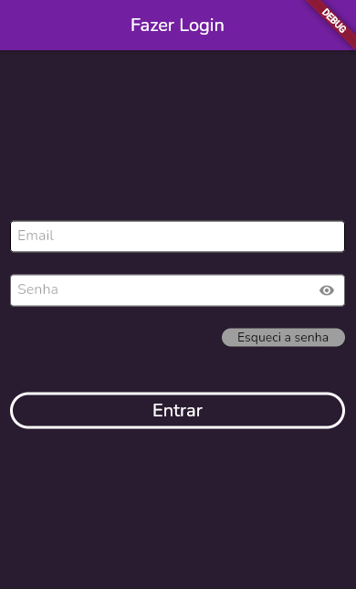
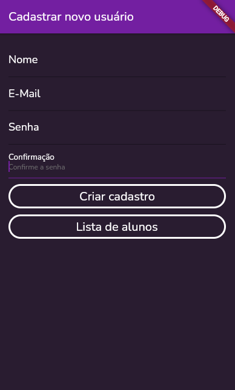
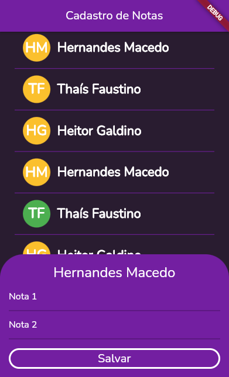
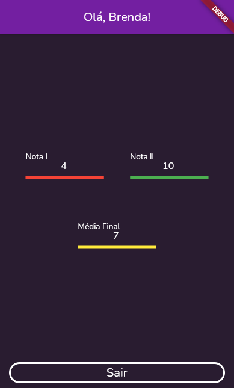

# Primeira Iteração

## Objetivo

- Desenvolver uma aplicação simples e funcional para controle de notas

### Requisitos

- Implementação de Firebase
- Estruturado em Redux
- Utilizando GitFlow

## Telas

### Login

	Esta tela possibilita ao professor e ao aluno realizarem login no sistema
	através de seu email e senha.
	
	Dependendo do usuário, cada um é direcionado para uma tela diferente.

### Cadastro de Alunos

	Nesta tela o professor é capaz de registrar no sistema novos alunos.
	

### Listagem de Alunos

	Nesta tela é possível visualizar os alunos cadastrados
	e também editar a nota do aluno.
	

### Visualização de Notas

	Nesta tela o aluno é capaz de visualizar suas notas e também recebe
	um retorno visual sobre seu de aprovação.
	

## Membros

- Hernandes Macedo
- Heitor Galdino
- Guilherme Brandt
- Bruno Costa
- Gabriel Carvalho
- Carlos Bueno
